---
# ==============================================================================
#  REPORT CONFIGURATION
# ==============================================================================
header-includes:
    # 1. Report Details
    - '\newcommand{\reportTitle}{Lab 3: Sequential Circuit Design}'
    - '\newcommand{\reportSubtitle}{Moore and Mealy Models for Sequence Detection}'
    
    # 2. Course Details
    - '\newcommand{\courseName}{Digital Systems Design}'
    - '\newcommand{\courseCode}{CSE 232}'
    
    # 3. Student Details
    - '\newcommand{\profName}{}'
    - '\newcommand{\taName}{}'
    
    # --------------------------------------------------------------------------
    #  Formatting Packages
    # --------------------------------------------------------------------------
    - '\usepackage{fancyhdr}'
    - '\usepackage{graphicx}'
    - '\usepackage{listings}'
    - '\usepackage{xcolor}'
    - '\usepackage{lastpage}'
    - '\usepackage{titling}'
    - '\pagestyle{fancy}'
    - '\fancyhead[L]{Alexandria University \\ Faculty of Engineering}'
    - '\fancyhead[R]{Computer and Systems Engineering \\ \courseName\ (\courseCode)}'
    - '\fancyfoot[L]{}'
    - '\fancyfoot[C]{Page \thepage\ of \pageref{LastPage}}'
    - '\fancyfoot[R]{}'
    - '\definecolor{codegreen}{rgb}{0,0.6,0}'
    - '\definecolor{codegray}{rgb}{0.5,0.5,0.5}'
    - '\definecolor{codepurple}{rgb}{0.58,0,0.82}'
    - '\definecolor{backcolour}{rgb}{0.95,0.95,0.92}'
    - '\lstdefinestyle{mystyle}{backgroundcolor=\color{backcolour}, commentstyle=\color{codegreen}, keywordstyle=\color{magenta}, numberstyle=\tiny\color{codegray}, stringstyle=\color{codepurple}, basicstyle=\ttfamily\footnotesize, breakatwhitespace=false, breaklines=true, captionpos=b, keepspaces=true, numbers=left, numbersep=5pt, showspaces=false, showstringspaces=false, showtabs=false, tabsize=2}'
    - '\usepackage{caption}'
    - '\DeclareCaptionFormat{listing}{\colorbox{gray!20}{\parbox{\dimexpr\linewidth-2\fboxsep\relax}{#1#2#3}}}'
    - '\captionsetup[lstlisting]{format=listing, labelfont={color=black}, textfont={color=black}, singlelinecheck=false, margin=0pt, font={bf,footnotesize}}'
    - '\lstset{style=mystyle, frame=single, frameround=tttt, rulecolor=\color{black}, numbers=none}'
    - '\usepackage{caption}'
    - '\captionsetup[figure]{font=small,labelfont=bf}'
    - '\usepackage{float}' # Keeps images where you put them
    - '\floatplacement{figure}{H}'
    - '\usepackage{hyperref}'

    # Set PDF Metadata
    - '\hypersetup{pdftitle={\reportTitle}, pdfauthor={Youssef Diaa, Mohamed Hamed, Mohamed Sabr, Abdelrahman Mohamed, Omar Mohamed}}'

# ==============================================================================
#  PANDOC SETTINGS
# ==============================================================================
geometry: margin=1in
colorlinks: true
linkcolor: violet
urlcolor: blue
toccolor: black
fontsize: 12pt
numbersections: true
---

\begin{center}
\vspace{2cm}

\Huge \textbf{\reportTitle} \\
\Large \textbf{\reportSubtitle}

\vspace*{1cm}
\Large \textbf{Alexandria University} \\
\large Faculty of Engineering \\
Computer and Systems Engineering Department


\vspace{1cm}

\large \textbf{Course:} \courseName\ (\courseCode)

\vspace{2cm}

\textbf{Submitted by:}

\begin{tabular}{ll}
Youssef Diaa Abdelmohsen Mahmoud Elghanam & 24010851 \\
Mohamed Hamed Mohamed & 24010593 \\
Mohamed Sabr Abbas Elsaid & 24010617 \\
Abdelrahman Mohamed Mohamed Seif Elnasr Mohamed & 24010397 \\
Omar Mohamed Abdelmohsen Mostafa Elsaid & 24010467 \\
\end{tabular}

\vspace{1cm}

\today

\end{center}

\newpage

\tableofcontents

\newpage

# Problem Statement

The goal of this lab is to design a sequential circuit with one input $X$ and one output $Z$. The circuit should be implemented using both Moore and Mealy models.

**Output Condition:**
$Z = 1$ if and only if:
1. The total number of 1's received is divisible by 4.
2. The total number of 0's received is an odd number.

Events should take place at each rising edge of the clock ($Clk$).

## Interface

| Signal | Type   | Description                    |
| :----- | :----- | :----------------------------- |
| $X$    | Input  | Input of the state machine     |
| $Clk$  | Input  | Clock to synchronize events    |
| $Z$    | Output | Output of the state machine    |

# State Machine Design

To track the conditions, we need to maintain:
- The count of 1's modulo 4 (0, 1, 2, 3).
- The parity of the count of 0's (Even, Odd).

This results in $4 \times 2 = 8$ states.

## State Definitions

| State Name | Ones mod 4 | Zeros parity | Z (Moore) |
| :--------- | :--------- | :----------- | :-------- |
| S_0_EVEN   | 0          | even         | 0         |
| S_0_ODD    | 0          | odd          | 1         |
| S_1_EVEN   | 1          | even         | 0         |
| S_1_ODD    | 1          | odd          | 0         |
| S_2_EVEN   | 2          | even         | 0         |
| S_2_ODD    | 2          | odd          | 0         |
| S_3_EVEN   | 3          | even         | 0         |
| S_3_ODD    | 3          | odd          | 0         |

## State Diagrams

The following figures show the state transitions for both models.

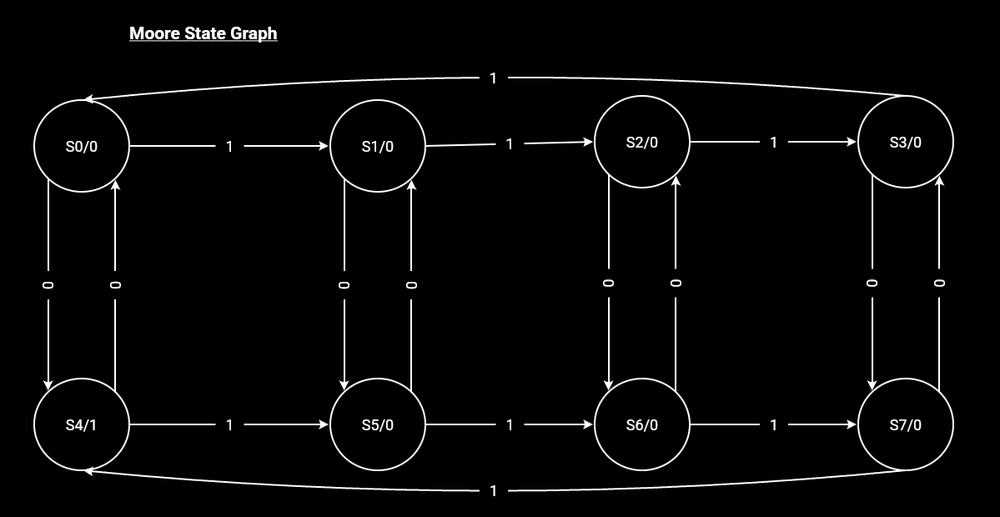

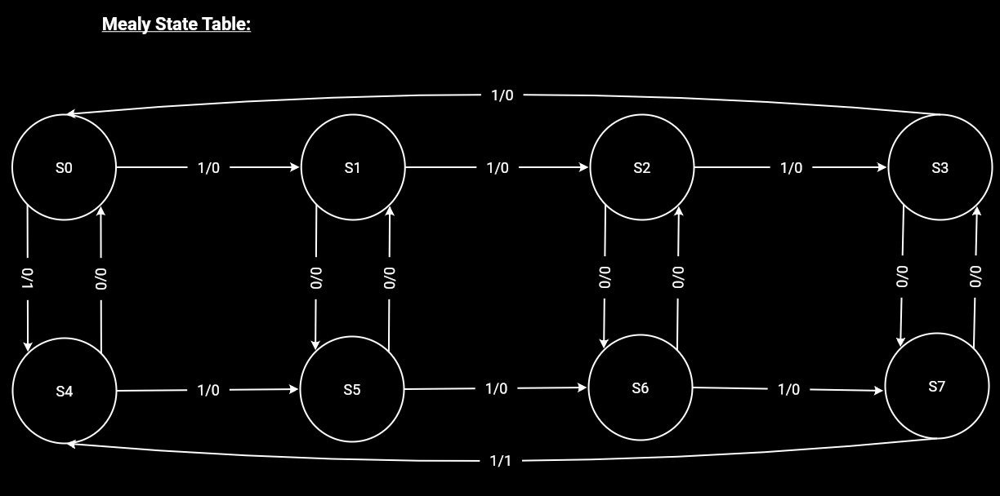

## Transition and State Tables

The following tables and Karnaugh maps provide the detailed logical design for both the Moore and Mealy implementations.

### Moore Model Design

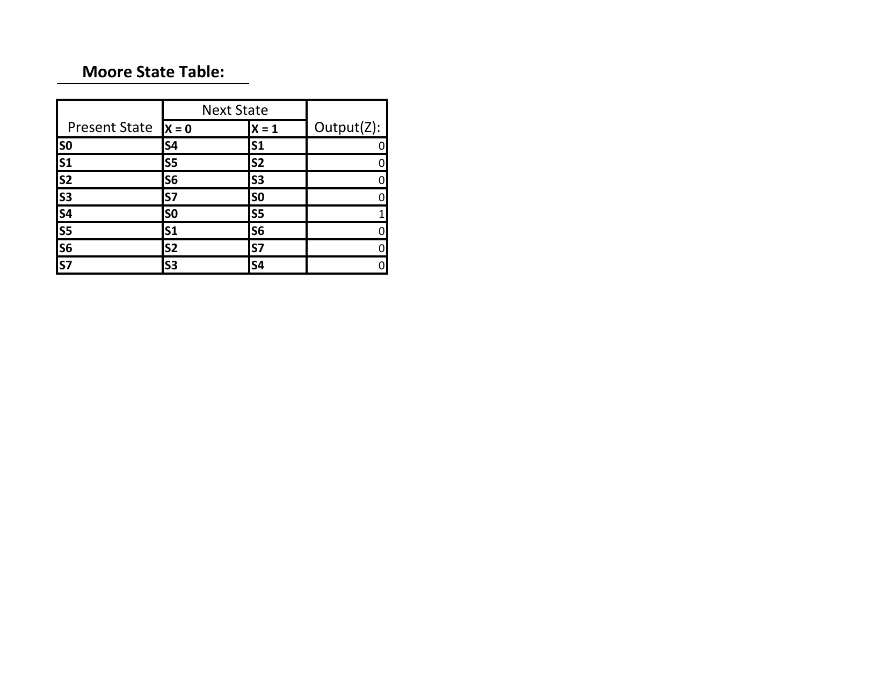

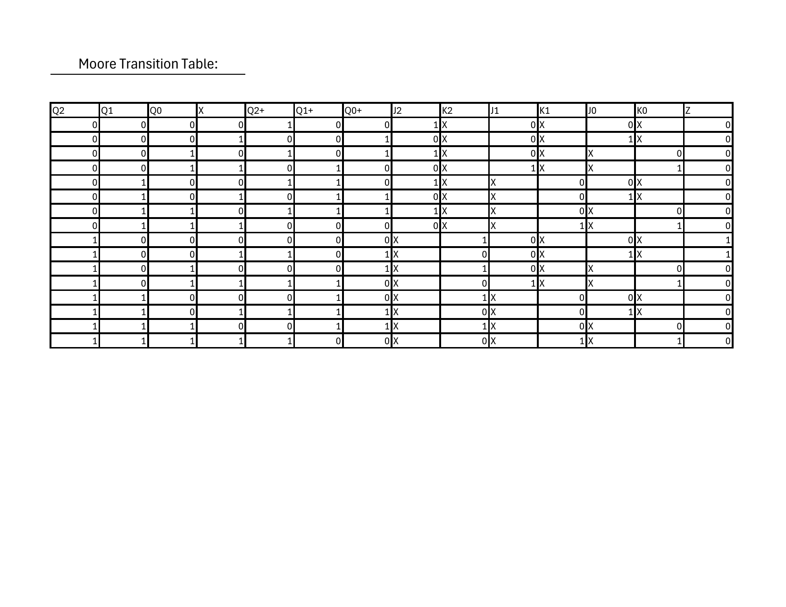

### Mealy Model Design (Bonus)

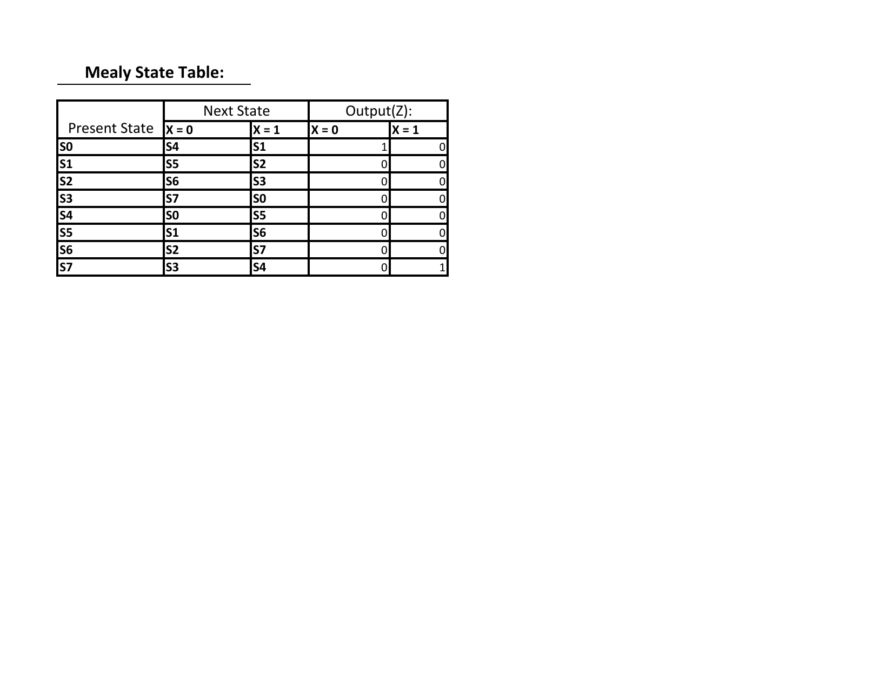

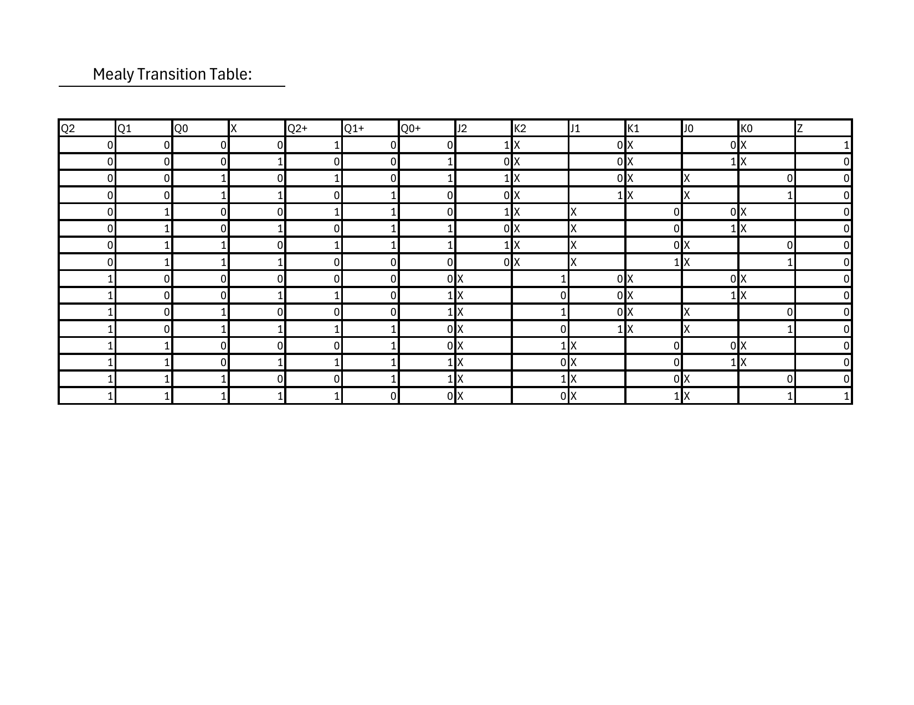

### Karnaugh Maps and Logic Equations

The logic equations were derived using the following Karnaugh maps:

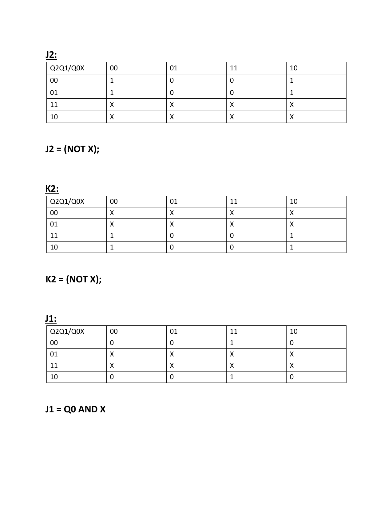

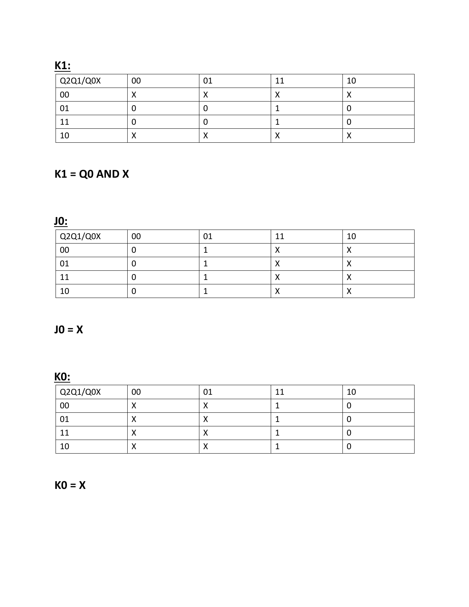

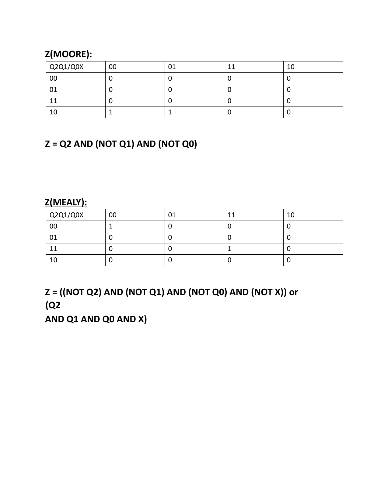

# Moore Model Implementation

The Moore model determines the output $Z$ based only on the current state.

## VHDL Implementation

The implementation uses a three-process approach:
1. **State Register:** Synchronous update of the state.
2. **Next State Logic:** Combinational logic to determine the next state.
3. **Output Logic:** Combinational logic to determine the output.

```vhdl
-- State Register
state_register: process(Clk)
begin
    if rising_edge(Clk) then
        current_state <= next_state;
    end if;
end process;

-- Output Logic (Moore)
output_logic: process(current_state)
begin
    case current_state is
        when S_0_ODD =>
            Z <= '1';
        when others =>
            Z <= '0';
    end case;
end process;
```

# Mealy Model Implementation (Bonus)

In the Mealy model, the output $Z$ depends on both the current state and the current input $X$. This allows the output to react immediately to changes in $X$ before the next clock edge.

## VHDL Implementation

The Mealy model often combines next state and output logic into a single combinational process.

```vhdl
mealy_logic: process(current_state, X)
begin
    Z <= '0'; -- Default
    case current_state is
        when S_0_EVEN =>
            if X = '0' then
                next_state <= S_0_ODD;
                Z <= '1'; -- React immediately
            else
                next_state <= S_1_EVEN;
            end if;
        -- ... other states ...
        when S_3_ODD =>
            if X = '0' then
                next_state <= S_3_EVEN;
            else
                next_state <= S_0_ODD;
                Z <= '1'; -- React immediately
            end if;
    end case;
end process;
```

# Moore vs Mealy Comparison

## Timing Differences

The key difference observed during simulation is the response time:
- **Moore:** The output $Z$ changes only on the rising edge of the clock after the input $X$ has changed.
- **Mealy:** The output $Z$ changes immediately when the input $X$ changes (combinational path).

| Feature | Moore Model | Mealy Model |
| :--- | :--- | :--- |
| Output depends on | Current state only | State and Input |
| Hardware response | One clock cycle delay | Immediate (asynchronous) |
| Stability | Stable, synchronous | Potential for glitches |

## Simulation Results

A comparison testbench was used to verify the functional equivalence and timing differences.

```vhdl
-- From tb_moore_mealy_comparison.vhd
report ">>> Changing X to 0 - CRITICAL MOMENT <<<";
X_tb <= '0';
wait for 1 ns;
report "Moore Z = " & std_logic'image(Z_moore) & " (Waiting for clock)";
report "Mealy Z = " & std_logic'image(Z_mealy) & " (Already 1!)";
```

# Simulation Results

The functionality of both the Moore and Mealy models was verified through timing simulations. The following waveforms demonstrate the circuit's response to various input sequences.

## Moore Model Simulation

The Moore model simulation confirms that the output $Z$ is synchronized with the rising edge of the clock. $Z$ only becomes high when the current state satisfies the condition (0 ones mod 4, odd zeros).

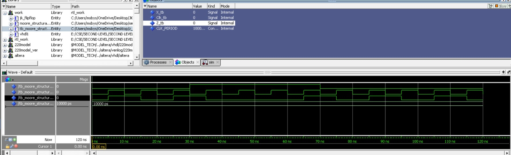

## Mealy Model Simulation

The Mealy model simulation highlights the asynchronous nature of the output. As seen in the waveform, $Z$ can react to changes in the input $X$ within the same clock cycle, providing a faster detection of the target sequence.

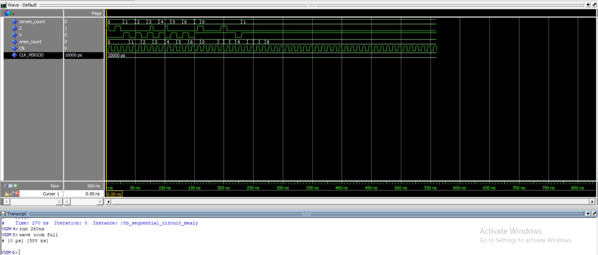

# Design Decisions and Assumptions

1. **State Encoding:** Enumerated types were used in VHDL for better readability and to let the synthesizer optimize the encoding.
2. **Reset:** A power-on initialization was assumed (`signal ... := S_0_EVEN`), as no explicit reset signal was required in the interface.
3. **Clock:** All transitions occur on the rising edge of the clock.

# Conclusion

The lab successfully demonstrated the design of sequential circuits using both Moore and Mealy architectures. The requirement of tracking ones (mod 4) and zeros (parity) was met using an 8-state FSM. The Mealy model provided a faster response time, while the Moore model offered more stable, clock-synchronized outputs.

\newpage

# Appendix: Source Code

## Moore Architecture

```vhdl
-- sequential_circuit_moore.vhd
library IEEE;
use IEEE.STD_LOGIC_1164.ALL;

entity sequential_circuit_moore is
    Port (
        X   : in  STD_LOGIC;
        Clk : in  STD_LOGIC;
        Z   : out STD_LOGIC
    );
end sequential_circuit_moore;

architecture Behavioral of sequential_circuit_moore is
    type state_type is (
        S_0_EVEN, S_0_ODD, S_1_EVEN, S_1_ODD,
        S_2_EVEN, S_2_ODD, S_3_EVEN, S_3_ODD
    );
    signal current_state, next_state : state_type := S_0_EVEN;
begin
    state_register: process(Clk)
    begin
        if rising_edge(Clk) then
            current_state <= next_state;
        end if;
    end process;

    next_state_logic: process(current_state, X)
    begin
        case current_state is
            when S_0_EVEN =>
                if X = '0' then next_state <= S_0_ODD; else next_state <= S_1_EVEN; end if;
            when S_0_ODD =>
                if X = '0' then next_state <= S_0_EVEN; else next_state <= S_1_ODD; end if;
            when S_1_EVEN =>
                if X = '0' then next_state <= S_1_ODD; else next_state <= S_2_EVEN; end if;
            when S_1_ODD =>
                if X = '0' then next_state <= S_1_EVEN; else next_state <= S_2_ODD; end if;
            when S_2_EVEN =>
                if X = '0' then next_state <= S_2_ODD; else next_state <= S_3_EVEN; end if;
            when S_2_ODD =>
                if X = '0' then next_state <= S_2_EVEN; else next_state <= S_3_ODD; end if;
            when S_3_EVEN =>
                if X = '0' then next_state <= S_3_ODD; else next_state <= S_0_EVEN; end if;
            when S_3_ODD =>
                if X = '0' then next_state <= S_3_EVEN; else next_state <= S_0_ODD; end if;
            when others =>
                next_state <= S_0_EVEN;
        end case;
    end process;

    output_logic: process(current_state)
    begin
        case current_state is
            when S_0_ODD => Z <= '1';
            when others  => Z <= '0';
        end case;
    end process;
end Behavioral;
```

## Mealy Architecture

```vhdl
-- sequential_circuit_mealy.vhd
library IEEE;
use IEEE.STD_LOGIC_1164.ALL;

entity sequential_circuit_mealy is
    Port (
        X   : in  STD_LOGIC;
        Clk : in  STD_LOGIC;
        Z   : out STD_LOGIC
    );
end sequential_circuit_mealy;

architecture Behavioral of sequential_circuit_mealy is
    type state_type is (
        S_0_EVEN, S_0_ODD, S_1_EVEN, S_1_ODD,
        S_2_EVEN, S_2_ODD, S_3_EVEN, S_3_ODD
    );
    signal current_state, next_state : state_type := S_0_EVEN;
begin
    state_register: process(Clk)
    begin
        if rising_edge(Clk) then
            current_state <= next_state;
        end if;
    end process;

    mealy_logic: process(current_state, X)
    begin
        Z <= '0';
        case current_state is
            when S_0_EVEN =>
                if X = '0' then next_state <= S_0_ODD; Z <= '1';
                else next_state <= S_1_EVEN; Z <= '0'; end if;
            when S_0_ODD =>
                if X = '0' then next_state <= S_0_EVEN; Z <= '0';
                else next_state <= S_1_ODD; Z <= '0'; end if;
            when S_1_EVEN =>
                if X = '0' then next_state <= S_1_ODD; Z <= '0';
                else next_state <= S_2_EVEN; Z <= '0'; end if;
            when S_1_ODD =>
                if X = '0' then next_state <= S_1_EVEN; Z <= '0';
                else next_state <= S_2_ODD; Z <= '0'; end if;
            when S_2_EVEN =>
                if X = '0' then next_state <= S_2_ODD; Z <= '0';
                else next_state <= S_3_EVEN; Z <= '0'; end if;
            when S_2_ODD =>
                if X = '0' then next_state <= S_2_EVEN; Z <= '0';
                else next_state <= S_3_ODD; Z <= '0'; end if;
            when S_3_EVEN =>
                if X = '0' then next_state <= S_3_ODD; Z <= '0';
                else next_state <= S_0_EVEN; Z <= '0'; end if;
            when S_3_ODD =>
                if X = '0' then next_state <= S_3_EVEN; Z <= '0';
                else next_state <= S_0_ODD; Z <= '1'; end if;
            when others =>
                next_state <= S_0_EVEN; Z <= '0';
        end case;
    end process;
end Behavioral;
```
